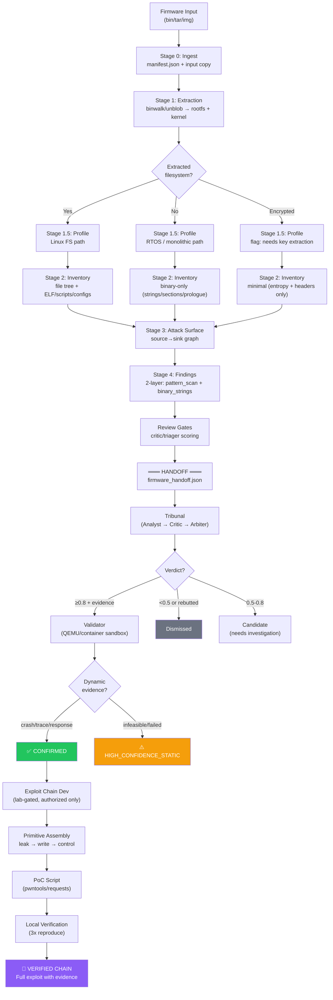

<div align="center">

# SCOUT (AIEdge)

### Firmware-to-Exploit Evidence Engine

**From firmware blob to verified exploit chain — deterministic evidence at every step.**

[](https://python.org)
[](LICENSE)

---

*Deterministic firmware analysis engine that produces hash-anchored evidence artifacts — from unpacking through vulnerability discovery to full-chain exploit verification.*

</div>

---

## Philosophy

**Every exploit starts with evidence. SCOUT produces the evidence chain.**

Most firmware analysis tools stop at "here's a list of potential vulnerabilities." SCOUT is designed around a different premise: the end goal is a **verified, reproducible exploit chain** — and every stage exists to build toward that.

```
Firmware blob → Structure → Attack surface → Vulnerability → Exploit primitive → PoC → Verified chain
```

SCOUT doesn't guess. Each stage produces **hash-anchored artifacts** in a `run_dir`, and no claim advances without traceable evidence. The engine is deterministic by default — LLM judgment and dynamic validation are layered on top by an orchestrator (Terminator), never baked into the evidence chain itself.

### Core Principles

- **Evidence-first** — No finding exists without a file path, offset, hash, and rationale anchored to artifacts
- **Fail-open stages, fail-closed governance** — Individual stages degrade gracefully (partial results over crashes); final promotion gates reject anything without complete evidence
- **Full-chain or nothing** — The pipeline doesn't stop at "potential command injection." It traces source→sink→primitive→chain→PoC→verification, marking exactly where the chain breaks
- **Deterministic engine, non-deterministic judgment** — SCOUT produces reproducible artifacts; LLM tribunal and exploit generation happen in the orchestrator layer with full audit trails

---

## Architecture

```
┌──────────────────────────────────────────────────────────────────────────┐
│                         SCOUT (Evidence Engine)                          │
│                                                                          │
│  Firmware ──► Unpack ──► Profile ──► Inventory ──► Surface ──► Findings  │
│                                                                          │
│  StageFactory stages: stage.json (sha256 manifest)                       │
│  Findings step: run_findings() writes structured artifacts               │
│                All paths run-relative, all hashes recorded               │
│                                                                          │
├──────────────────────────────────────────────────────────────────────────┤
│                    Handoff (JSON contract)                                │
├──────────────────────────────────────────────────────────────────────────┤
│                   Terminator (Orchestrator)                               │
│                                                                          │
│  Tribunal ──► Validator ──► Exploit Dev ──► Verified Chain               │
│  (LLM judge)  (emulation)   (lab-gated)    (confirmed only              │
│                                              with dynamic evidence)      │
└──────────────────────────────────────────────────────────────────────────┘
```

**Separation of concerns:**

| Layer | Role | Deterministic? |
|:------|:-----|:--------------:|
| **SCOUT** | Evidence production (extraction, profiling, inventory, surfaces, findings) | Yes |
| **Handoff** | JSON contract between engine and orchestrator (`firmware_handoff.json`) | Yes |
| **Terminator** | LLM tribunal, dynamic validation, exploit development, report promotion | No (auditable) |

---

## The Pipeline: Firmware → Full-Chain Exploit



---

## Stage Details

### Stage 0: Ingest + Run Setup

Creates the immutable run directory and locks all inputs.

```
run_dir/
├── manifest.json          # sha256, size, case_id, time_budget, egress policy
└── input/firmware.bin     # immutable copy of input
```

No analysis happens here — just identity, policy, and directory reservation.

### Stage 1: Extraction / Unpack

Maximally extracts filesystem, kernel, and partition fragments from the firmware blob.

```
stages/extraction/
├── stage.json             # sha256 of all artifacts
├── binwalk.log            # full extraction log
└── _firmware.bin.extracted/
    ├── squashfs-root/     # extracted rootfs (if Linux)
    ├── *.uImage           # kernel images
    └── ...                # partition fragments
```

**Tools**: binwalk, unblob, jefferson, sasquatch, ubi_reader

**AI role**: None (rule-based). Custom format detection is a future extension.

### Stage 1.5: Firmware Profiling

Classifies the firmware and decides the pipeline branch. This is the routing decision for everything downstream.

```
stages/firmware_profile/
├── stage.json
└── firmware_profile.json
```

**`firmware_profile.json` schema:**

```json
{
  "schema_version": "1.0",
  "firmware_id": "sha256:e3d3fe...",
  "os_type_guess": "linux_fs | rtos_monolithic | unextractable_or_unknown",
  "arch_hints": {
    "arch": "mips32",
    "endian": "big",
    "evidence_refs": ["stages/extraction/binwalk.log:line:42"]
  },
  "sdk_hints": {
    "rule_based": ["EdgeOS", "Debian-derivative"],
    "ai_hypotheses": []
  },
  "fs_type": "squashfs",
  "emulation_feasibility": "high | medium | low",
  "branch_plan": {
    "inventory_mode": "linux_fs_walk | binary_only | minimal_entropy",
    "surface_extraction": true,
    "dynamic_validation_viable": true
  },
  "evidence_refs": [...],
  "limitations": [...]
}
```

**Branching logic:**

| Profile Result | Inventory Mode | Surface Extraction | Dynamic Validation |
|:---------------|:---------------|:-------------------|:-------------------|
| `linux_fs` | Full file tree walk | Yes (init/services/web/CGI) | Viable (QEMU/FirmAE) |
| `rtos_monolithic` | Binary-only (strings/sections/prologues) | Limited (string-inferred) | Limited (Unicorn/partial) |
| `unextractable_or_unknown` | Minimal (entropy + headers) | No | No |

### Stage 2: Inventory / Enumeration

Catalogs everything in the extracted firmware. **Never crashes** — partial results are always better than no results.

```
stages/inventory/
├── stage.json
├── inventory.json         # file/binary catalog with coverage metrics
└── string_hits.json       # interesting string patterns across all binaries
```

**`inventory.json` key fields:**

```json
{
  "status": "ok | partial",
  "coverage_metrics": {
    "roots_considered": 3,
    "roots_scanned": 2,
    "files_seen": 4521,
    "skipped_dirs_count": 2,
    "skipped_files_count": 14
  },
  "errors": [
    {
      "path": "etc/ssh/ssh_config.d/etc",
      "op": "listdir",
      "errno": 13,
      "message": "Permission denied (sanitized)"
    }
  ],
  "entries": [...]
}
```

**Robustness guarantees:**
- Permission-denied directories → skip and record in `errors[]`, continue scanning
- Symlink loops → detect via `os.lstat()`, skip, record
- Dangling symlinks → record as metadata, don't follow
- Corrupt filenames → hex-escape, record
- `inventory.json` is **always written**, even if completely empty (with `status: "partial"` and reason)

### Stage 3: Attack Surface Mapping

Identifies the entry points an attacker can reach and traces them toward dangerous sinks.

```
stages/surfaces/
├── surfaces.json          # network services, web endpoints, CLI interfaces
├── endpoints.json         # specific input handlers (CGI, REST, SOAP, MQTT, ...)
└── source_sink_graph.json # source→processing→sink candidate paths
```

**Source categories:**
- Network: HTTP/HTTPS, MQTT, CoAP, UPnP/SSDP, Telnet, SSH, custom TCP/UDP
- Local: CLI, NVRAM reads, environment variables, config file parsing, IPC/Unix sockets
- Hardware: UART, JTAG, SPI/I2C (noted for physical access scenarios)

**Sink categories (exploit-relevant):**
- Command execution: `system()`, `popen()`, `execve()`, shell invocations
- Memory corruption: `strcpy()`, `sprintf()`, `memcpy()` without bounds, heap ops
- File operations: `open()` with user-controlled paths, symlink races
- Authentication: hardcoded credentials, bypass conditions, weak token generation
- Crypto: weak algorithms, key reuse, nonce mismanagement

**The graph is the exploit planner's input** — each path from source to sink is a potential exploit chain candidate.

### Stage 4: Findings + Review Gates

Two-layer findings with deterministic scoring, designed for tribunal consumption.

```
stages/findings/
├── pattern_scan.json          # high-level findings (AI-consumable)
├── binary_strings_hits.json   # low-level string evidence across binaries
├── chains.json                # kill-chain hypotheses (source→sink→primitive→impact)
├── review_gates.json          # critic/triager scoring per finding
├── known_disclosures.json     # CVE matches with NVD citations
└── poc_skeletons/
    └── README.txt             # safe placeholders (no weaponized content)
```

**Finding structure (each entry in `pattern_scan.json`):**

```json
{
  "finding_id": "F-037",
  "title": "Command injection via HTTP POST parameter in lighttpd CGI handler",
  "vuln_class": "CWE-78",
  "severity_estimate": "critical",
  "source": {
    "type": "http_post",
    "binary": "usr/sbin/lighttpd",
    "handler": "cgi_handler",
    "parameter": "cmd"
  },
  "sink": {
    "function": "system",
    "binary": "usr/lib/cgi-bin/admin.cgi",
    "offset": "0x401890"
  },
  "taint_path": ["recv", "parse_post_params", "build_command", "system"],
  "evidence_refs": [
    "stages/inventory/inventory.json:entries[142]",
    "stages/findings/binary_strings_hits.json:hits[37]"
  ],
  "chain_potential": {
    "primitive": "arbitrary_command_execution",
    "auth_required": false,
    "network_reachable": true,
    "exploit_complexity": "low"
  },
  "rationale": "...",
  "limitations": ["static analysis only, sink reachability not dynamically confirmed"]
}
```

**`chains.json` — Kill-chain hypotheses:**

Each chain maps a complete attack path from initial access to impact:

```json
{
  "chain_id": "KC-003",
  "title": "Unauthenticated RCE via CGI command injection",
  "steps": [
    {"step": 1, "action": "HTTP POST to /cgi-bin/admin.cgi", "finding_ref": "F-037"},
    {"step": 2, "action": "Inject shell command via 'cmd' parameter", "finding_ref": "F-037"},
    {"step": 3, "action": "Achieve root shell (CGI runs as root)", "finding_ref": "F-012"}
  ],
  "preconditions": ["network access to management interface", "no authentication required"],
  "impact": "full device compromise (root shell)",
  "confidence": "high_confidence_static",
  "exploit_feasibility": "high"
}
```

---

## Exploit Promotion Policy

**Iron Rule: No Evidence, No Confirmed.**

```
┌─────────────┬──────────────────────────────────────┬────────────────────┐
│ Level       │ Requirements                          │ Appears In         │
├─────────────┼──────────────────────────────────────┼────────────────────┤
│ dismissed   │ Critic rebuttal strong OR             │ Appendix only      │
│             │ tribunal confidence < 0.5             │                    │
├─────────────┼──────────────────────────────────────┼────────────────────┤
│ candidate   │ Tribunal confidence 0.5 - 0.8        │ Report (flagged)   │
│             │ Evidence exists but chain incomplete  │                    │
├─────────────┼──────────────────────────────────────┼────────────────────┤
│ high_conf   │ Tribunal confidence ≥ 0.8            │ Report (prominent) │
│ _static     │ Static evidence strong                │                    │
│             │ No dynamic validation available       │                    │
├─────────────┼──────────────────────────────────────┼────────────────────┤
│ confirmed   │ Tribunal confidence ≥ 0.8 AND        │ Report (top)       │
│             │ ≥1 dynamic validation artifact:      │                    │
│             │  • crash trace                        │                    │
│             │  • execution log with controlled I/O  │                    │
│             │  • network response showing code path │                    │
├─────────────┼──────────────────────────────────────┼────────────────────┤
│ verified    │ Confirmed AND full PoC reproduces 3x │ Exploit report     │
│ _chain      │ in sandboxed environment             │                    │
│             │ Complete: access → primitive → impact │                    │
└─────────────┴──────────────────────────────────────┴────────────────────┘
```

`verified_chain` is the end goal. Everything before it is a step on the path.

---

## Integration with Terminator

SCOUT produces evidence. Terminator consumes it, judges it, validates it, and builds exploits.

```
SCOUT run_dir/                     Terminator report_dir/
├── manifest.json                  ├── tribunal/
├── stages/                        │   ├── analyst_candidates.jsonl
│   ├── extraction/                │   ├── critic_reviews.jsonl
│   ├── firmware_profile/          │   ├── judged_findings.jsonl
│   ├── inventory/                 │   └── decision_trace.jsonl
│   ├── surfaces/                  ├── validation/
│   └── findings/                  │   └── emulation_results/
│       ├── pattern_scan.json      ├── exploits/
│       ├── chains.json            │   ├── chain_KC-003/
│       └── known_disclosures.json │   │   ├── exploit.py
│                                  │   │   ├── local_test_log.txt (3x)
│                                  │   │   └── evidence_bundle.json
│                                  └── report/
│                                      ├── report.json
│                                      └── audit_trail.json

firmware_handoff.json (index only)
├── aiedge_run_dir: "path/to/run"
├── terminator_report_dir: "path/to/report"
├── stage_status: {...}
├── tribunal_summary: {total: 120, confirmed: 8, verified_chains: 2}
└── orchestration_meta: {wallclock, token_cost, ...}
```

**Terminator agents for firmware pipeline:**

| Agent | Role | Reused? |
|:------|:-----|:--------|
| `fw_profiler` | Interprets profiling artifacts, suggests analysis strategy | New |
| `fw_surface` | Deep-dives attack surface using decompiled code | New |
| `fw_analyst` | Tribunal Analyst — aggressive finding generation | New |
| `critic` | Tribunal Critic — adversarial rebuttal | **Reused from Terminator** |
| `triager_sim` | Tribunal Arbiter — final verdict | **Reused from Terminator** |
| `fw_validator` | Dynamic validation via emulation/sandbox | New |
| `chain` | Exploit chain assembly (leak→write→control) | **Reused from Terminator** |
| `verifier` | 3x local reproduction of full exploit | **Reused from Terminator** |
| `reporter` | Final report with evidence citations | **Reused from Terminator** |

---

## Quick Start

### Basic Analysis (SCOUT only, no LLM)

```bash
cd /path/to/SCOUT

# Full deterministic analysis
PYTHONPATH=src python3 -m aiedge analyze firmware.bin \
  --ack-authorization --no-llm \
  --case-id my-analysis \
  --stages tooling,extraction,structure,carving,firmware_profile,inventory

# Rerun specific stages on existing run
PYTHONPATH=src python3 -m aiedge stages aiedge-runs/<run_id> \
  --ack-authorization --no-llm \
  --stages inventory
```

### With Terminator Orchestration (Full Pipeline)

```bash
cd /path/to/Terminator

# Full firmware pipeline: SCOUT analysis → tribunal → validation → exploit dev
./terminator.sh firmware /path/to/firmware.bin

# Monitor
./terminator.sh status
./terminator.sh logs
```

### Verifying Results

```bash
# Digest-first analyst entrypoint (must exist and verify)
test -f aiedge-runs/<run_id>/report/analyst_digest.json
test -f aiedge-runs/<run_id>/report/analyst_digest.md
python3 scripts/verify_analyst_digest.py --run-dir aiedge-runs/<run_id>

# Verified-chain hard gates (all must return [OK] for VERIFIED)
python3 scripts/verify_run_dir_evidence_only.py --run-dir aiedge-runs/<run_id>
python3 scripts/verify_network_isolation.py --run-dir aiedge-runs/<run_id>
python3 scripts/verify_exploit_meaningfulness.py --run-dir aiedge-runs/<run_id>
python3 scripts/verify_verified_chain.py --run-dir aiedge-runs/<run_id>

# SCOUT evidence integrity
python3 scripts/verify_aiedge_analyst_report.py --run-dir aiedge-runs/<run_id>

# Terminator tribunal artifacts
python3 bridge/validate_tribunal_artifacts.py --report-dir reports/<report_id>

# Confirmed policy enforcement
python3 bridge/validate_confirmed_policy.py --report-dir reports/<report_id>
```

Single-pane operator overview (additive, offline-safe):

- Open `aiedge-runs/<run_id>/report/viewer.html`.
- Derived payload is `aiedge-runs/<run_id>/report/analyst_overview.json` (`schema_version="analyst_overview-v1"`).
- `viewer.html` embeds bootstrap JSON and shows `#file-warning` for `file://` fetch limitations.
- Caveats:
  - `manifest.profile=analysis` means verified-chain gate is not applicable.
  - `manifest.track.track_id=8mb` means final 8MB report-contract gate is applicable.
- Trust boundary: viewer output is not a verifier; authoritative checks remain:
  - `python3 scripts/verify_analyst_digest.py --run-dir aiedge-runs/<run_id>`
  - `python3 scripts/verify_aiedge_analyst_report.py --run-dir aiedge-runs/<run_id>`

---

## Run Directory Structure

Every analysis produces a self-contained, reproducible `run_dir`:

```
aiedge-runs/<timestamp>_<sha256-prefix>/
├── manifest.json                              # immutable: input identity + policy
├── input/
│   └── firmware.bin                           # immutable copy
├── stages/
│   ├── tooling/
│   │   └── stage.json                         # tool versions + availability
│   ├── extraction/
│   │   ├── stage.json
│   │   ├── binwalk.log
│   │   └── _firmware.bin.extracted/           # extracted filesystem tree
│   ├── structure/
│   │   ├── stage.json
│   │   └── structure.json                     # partition layout + magic bytes
│   ├── carving/
│   │   ├── stage.json
│   │   └── carving.json                       # carved fragments + rootfs candidates
│   ├── firmware_profile/
│   │   ├── stage.json
│   │   └── firmware_profile.json              # OS/arch/SDK/branch_plan
│   ├── inventory/
│   │   ├── stage.json
│   │   ├── inventory.json                     # file catalog + coverage metrics
│   │   └── string_hits.json                   # interesting strings across binaries
│   ├── surfaces/
│   │   ├── stage.json
│   │   ├── surfaces.json                      # network services + interfaces
│   │   ├── endpoints.json                     # input handlers
│   │   └── source_sink_graph.json             # taint path candidates
│   └── findings/
│       ├── pattern_scan.json                  # structured findings
│       ├── binary_strings_hits.json           # string-level evidence
│       ├── chains.json                        # kill-chain hypotheses
│       ├── review_gates.json                  # scoring per finding
│       ├── known_disclosures.json             # CVE matches
│       └── poc_skeletons/                     # safe templates
└── report/
    ├── report.json                            # aggregated report
    ├── report.html                            # human-readable
    ├── analyst_overview.json                  # additive operator payload (derived)
    └── viewer.html                            # additive single-pane viewer (offline-safe)
```

**Every StageFactory `stage.json` contains (findings is emitted by `run_findings()`):**

```json
{
  "stage": "inventory",
  "status": "ok | partial | failed",
  "started_at": "2026-02-16T03:26:00Z",
  "finished_at": "2026-02-16T03:27:14Z",
  "artifacts": [
    {
      "path": "stages/inventory/inventory.json",
      "sha256": "a1b2c3..."
    }
  ],
  "limitations": [...]
}
```

---

## Contracts & Documentation

| Document | Purpose |
|:---------|:--------|
| `docs/blueprint.md` | Full pipeline architecture and design rationale |
| `docs/status.md` | Current implementation status — single source of truth |
| `docs/aiedge_firmware_artifacts_v1.md` | Schema contracts for profiling + inventory artifacts |
| `docs/aiedge_adapter_contract.md` | Terminator↔SCOUT handoff protocol |
| `docs/aiedge_report_contract.md` | Report structure and governance rules |
| `docs/analyst_digest_contract.md` | Canonical `report/analyst_digest.json` schema and verdict semantics |
| `docs/runbook.md` | Operator flow for digest-first review + verified-chain proof gates |
| `docs/codex_first_agent_policy.md` | Codex-first execution policy and fallback/limitations |

---

## Toolchain

### Extraction & Unpacking

| Tool | Purpose |
|:-----|:--------|
| binwalk | Signature scanning + recursive extraction |
| unblob | Modern firmware extraction (handles edge cases binwalk misses) |
| jefferson | JFFS2 extraction |
| sasquatch | Non-standard squashfs extraction |
| ubi_reader | UBI/UBIFS extraction |

### Binary Analysis

| Tool | Purpose |
|:-----|:--------|
| Ghidra (headless + MCP) | Decompilation, CFG, function signatures |
| radare2 (+ MCP) | Disassembly, xrefs, string analysis |
| readelf / objdump | ELF metadata, sections, symbols |
| checksec | Protection matrix (NX/PIE/RELRO/Canary) |
| strings | Raw string extraction |
| FLIRT/Lumina | Library function signature matching |
| rbasefind | Base address detection for RTOS blobs |

### Emulation & Dynamic

| Tool | Purpose |
|:-----|:--------|
| QEMU user-mode | Single binary execution (cross-arch) |
| QEMU system-mode | Full system emulation |
| FirmAE | Automated firmware emulation (~80% boot rate) |
| Unicorn Engine | Partial function emulation |
| GDB + pwndbg | Debugging in emulated environment |

### Fuzzing (Stage 6+)

| Tool | Purpose |
|:-----|:--------|
| AFL++ QEMU mode | Cross-architecture greybox fuzzing |
| libFuzzer | In-process fuzzing (when source available) |
| Boofuzz | Network protocol fuzzing |
| AFLNet | Stateful network protocol fuzzing |

### Exploit Development

| Tool | Purpose |
|:-----|:--------|
| pwntools | Exploit framework (ROP, shellcraft, tubes) |
| ROPgadget / ropper | Gadget discovery |
| one_gadget | Quick win exploit primitives |
| angr | Symbolic execution for path validation |

---

## Security & Ethics

> **AUTHORIZED ENVIRONMENTS ONLY**

SCOUT and the Terminator firmware pipeline are designed for:

- **Authorized security assessments** — contracted firmware security audits with explicit vendor permission
- **Vulnerability research** — responsible disclosure with coordinated timelines
- **CTF / lab environments** — practice and training on designated targets

**Strict guardrails:**
- Dynamic validation runs in sandboxed containers with no external network access
- Exploit development requires explicit `--ack-authorization` and lab environment confirmation
- No weaponized payloads in default output — `poc_skeletons/` contains safe templates only
- Full audit trail for every LLM judgment and exploit generation step
- `confirmed` status requires dynamic evidence — no exceptions

---

## License

MIT License
