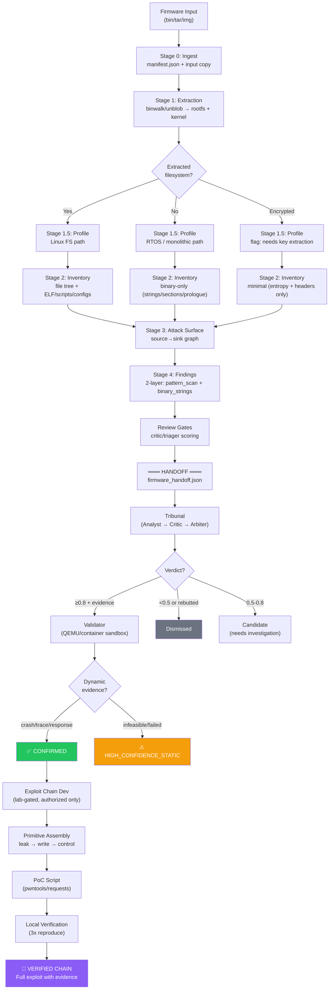

<div align="center">

# SCOUT (AIEdge)

### Firmware-to-Exploit Evidence Engine

**From firmware blob to verified exploit chain — deterministic evidence at every step.**

[](https://python.org)
[](LICENSE)

---

**Languages:** English (this file), [한국어 README.ko.md](README.ko.md)

*Deterministic firmware analysis engine that produces hash-anchored evidence artifacts — from unpacking through vulnerability discovery to full-chain exploit verification.*

</div>

---

## Philosophy

**Every exploit starts with evidence. SCOUT produces the evidence chain.**

Most firmware analysis tools stop at "here's a list of potential vulnerabilities." SCOUT is designed around a different premise: the end goal is a **verified, reproducible exploit chain** — and every stage exists to build toward that.

```
Firmware blob → Structure → Attack surface → Vulnerability → Exploit primitive → PoC → Verified chain
```

SCOUT doesn't guess. Each stage produces **hash-anchored artifacts** in a `run_dir`, and no claim advances without traceable evidence. The engine is deterministic by default — LLM judgment and dynamic validation are layered on top by an orchestrator (Terminator), never baked into the evidence chain itself.

### Core Principles

- **Evidence-first** — No finding exists without a file path, offset, hash, and rationale anchored to artifacts
- **Fail-open stages, fail-closed governance** — Individual stages degrade gracefully (partial results over crashes); final promotion gates reject anything without complete evidence
- **Full-chain or nothing** — The pipeline doesn't stop at "potential command injection." It traces source→sink→primitive→chain→PoC→verification, marking exactly where the chain breaks
- **Deterministic engine, non-deterministic judgment** — SCOUT produces reproducible artifacts; LLM tribunal and exploit generation happen in the orchestrator layer with full audit trails

---

## What changed recently (quick sync notes)

- **SBOM & CVE scanning** — New `sbom` stage generates CycloneDX 1.6 SBOM from firmware inventory (opkg/dpkg package DBs, binary version strings, SO library versions, kernel version). New `cve_scan` stage queries NVD API 2.0 with CPE matching. Auto-generates finding candidates for critical/high CVEs. Configure via `AIEDGE_NVD_API_KEY`, `AIEDGE_NVD_CACHE_DIR`.
- **Security assessment modules** — New `cert_analysis.py` (X.509 certificate scanning: expired, weak key/signature, self-signed, private keys exposed), `init_analysis.py` (boot service auditing: SysV, systemd, BusyBox inittab, OpenWrt procd; flags telnet/FTP/UPnP/SNMP), `fs_permissions.py` (world-writable files, SUID/SGID, sensitive file permission auditing).
- **MCP server** — New `mcp` subcommand exposes 12 SCOUT tools via Model Context Protocol (JSON-RPC 2.0 over stdio). Any MCP-compatible AI agent (Claude Code, Claude Desktop, etc.) can drive firmware analysis. Usage: `./scout mcp --project-id <run_id>`, then `claude mcp add scout -- ./scout mcp --project-id <id>`.
- **LLM driver expansion** — `ClaudeAPIDriver` (direct Claude API via `urllib.request`, `ANTHROPIC_API_KEY`) and `OllamaDriver` (local LLM server, `AIEDGE_OLLAMA_URL`). Select via `AIEDGE_LLM_DRIVER=codex|claude|ollama`. Cost tracking via `llm_cost.py` with optional budget limit (`AIEDGE_LLM_BUDGET_USD`).
- **CVE reachability analysis** — New `reachability` stage determines whether CVE-matched components are actually reachable from the attack surface via BFS on the communication graph. Classifies: `directly_reachable` (≤2 hops), `potentially_reachable` (3+), `unreachable`.
- **Firmware comparison** — New `firmware_diff.py` compares two analysis runs: filesystem diff (added/removed/modified/permissions), binary hardening diff (NX/PIE/RELRO changes), config security diff (unified diff with security keyword highlighting). CLI: `./scout diff <old_run> <new_run>`.
- **GDB emulation support** — New `emulation_gdb.py` provides a pure-stdlib GDB Remote Serial Protocol client. Connects to QEMU `-g` stub for register reads, memory inspection, breakpoints, backtraces.
- **Ghidra headless integration** — New `ghidra_bridge.py` + `ghidra_analysis.py` stage. Optional Ghidra decompilation, cross-references, dataflow tracing (source→sink with actual function analysis). SHA-256 cache for analyzed binaries. Runtime-optional (graceful skip if Ghidra not installed).
- **AFL++ fuzzing pipeline** — New `fuzz_target.py` (binary scoring 0-100), `fuzz_harness.py` (dictionary/seed/harness generation), `fuzz_campaign.py` (AFL++ Docker with QEMU mode), `fuzz_triage.py` (crash exploitability classification). Runtime-optional (graceful skip if Docker/AFL++ not available).
- **Executive report generation** — New `report_export.py` generates Markdown executive reports with pipeline summary, top risks, SBOM/CVE tables, attack surface, credential findings.
- **Web viewer UX overhaul** — Single-pane navigation (sidebar click shows one panel, hides others), persistent KPI summary bar (Critical/High CVEs, Components, Endpoints), new panels for SBOM, CVE Scan, Reachability, Security Assessment. Improved text contrast for readability. Graph re-rendering on panel switch.
- **Pipeline expansion** — 29 → 34 registered stages: `ghidra_analysis`, `sbom`, `cve_scan`, `reachability`, `fuzzing` added to the pipeline.
- **IPC detection pipeline** — Unix socket, D-Bus service, shared memory, named pipe detection from firmware rootfs. ELF binary `.rodata`/`.dynstr` scanning for IPC symbols (socket, bind, dbus_*, shm_open, fork, execve). New `ipc_channel` graph nodes and 5 IPC edge types (`ipc_unix_socket`, `ipc_dbus`, `ipc_shm`, `ipc_pipe`, `ipc_exec_chain`). IPC-specific risk scoring in attack surface.
- **Source→sink path tracing** — `surfaces` stage now generates `source_sink_graph.json` linking network-facing endpoints through service components to exec sink binaries (system, popen, execve). Enables "where does input reach dangerous functions?" analysis.
- **Credential auto-mapping** — `findings` stage generates `credential_mapping.json` mapping SSH keys, password hashes, API tokens, and default credentials to auth surfaces (SSH, web, OS). Risk-rated (high/medium/low).
- **Verifier reason codes** — `dynamic_validation` emits `isolation_verified`/`boot_verified`/`pcap_captured`; `poc_validation` emits `repro_3_of_3`. These enable findings to reach `VERIFIED` verdict state.
- **Interactive web viewer** — Glassmorphism dark theme with pure JS force-directed graph (no external dependencies). New panels: IPC Map, Source→Sink Paths, Credential Map, Risk Heatmap. Stat card grids, pipeline progress bar, collapsible cards, dark/light toggle, global search.
- **Binary hardening analysis** — Pure-Python ELF parser detects NX, PIE, RELRO, Stack Canary, and Stripped status per binary. Integrated into `inventory/binary_analysis.json` with `hardening_summary`. Findings scores are adjusted based on hardening (fully hardened: x0.7, no protection: x1.15).
- **3-tier emulation** — Emulation stage now supports three tiers: Tier 1 FirmAE system emulation (Docker container, no sudo required), Tier 2 QEMU user-mode service probing (lighttpd, busybox, dnsmasq, sshd, etc.), Tier 3 rootfs inspection (Alpine Docker fallback). Configure via `AIEDGE_EMULATION_IMAGE` and `AIEDGE_FIRMAE_ROOT`.
- **Endian-aware architecture detection** — MIPS and ARM binaries are now classified with endianness: `mips_be`, `mips_le`, `arm_be`, `arm_le` (previously just `mips-32`/`arm-32`).
- **LLM driver abstraction** — New `llm_driver.py` provides an `LLMDriver` Protocol with `CodexCLIDriver` implementation. All three LLM call sites (llm_synthesis, exploit_autopoc, llm_codex) now use `resolve_driver()`. Select provider via `AIEDGE_LLM_DRIVER` env var. Supports `ModelTier` ("haiku"|"sonnet"|"opus").
- **Vulnerability-type PoC templates** — `poc_templates.py` provides a template registry with 4 vulnerability-specific skeletons: `cmd_injection`, `path_traversal`, `auth_bypass`, `info_disclosure` (+ `tcp_banner` fallback). Standalone PoC files in `poc_skeletons/`.
- **Real PCAP capture** in `exploit_runner.py` — tcpdump capture when available (PCAP placeholder fallback retained).
- **PoC reproducibility validation** — `poc_validation` now verifies readback_hash consistency across reproduction runs.
- **LLM-assisted finding triage** (`llm_triage` stage) — New stage between `findings` and `llm_synthesis`. Auto-selects model tier: <10 candidates → haiku, 10–50 → sonnet, >50 → opus. Includes hardening and attack_surface security context in prompts. Graceful skip under `--no-llm`.
- **Bidirectional Terminator feedback loop** — `terminator_feedback.py` adds `feedback_request` section to `firmware_handoff.json`. Terminator verdicts (confirmed boost, false_positive suppress) feed back into `duplicate_gate`. Configure via `AIEDGE_FEEDBACK_DIR`.
- `--rootfs /path/to/extracted_rootfs` is now supported on `analyze` and `analyze-8mb`.
  - This bypasses weak/partial unpacking for multi-layer firmware layouts (e.g., nested tar/gzip/bzip2/cpio/ext images).
- Extraction now has a built-in quality gate.
  - Low extraction coverage is marked as insufficient (`partial`) with explicit operator guidance.
- Inventory now emits deeper artifacts:
  - `stages/inventory/binary_analysis.json` (+ hardening data per binary)
  - `inventory.json.quality` + `inventory.json.binary_analysis_summary`
  - config-driven service hints (`services`, `inetd`, `xinetd`, web server configs).
- `firmware_profile` now cross-checks OS/arch hints from discovered ELF binaries (`arch_guess`, `elf_hints`) to reduce RTOS false positives.
- `firmware_handoff.json` is now auto-generated by SCOUT (`analyze` and `stages`) with run policy + artifact bundles.
- `./scout` is now the preferred launcher (shorter than `PYTHONPATH=... python3 -m aiedge ...`).
- Dynamic validation and exploit auto-generation are now linked through **exploit evidence bundle** flow:
  - `stages/dynamic_validation/*.json` records validation outcomes
  - `stages/exploit_autopoc/*` + `exploits/chain_*` receives `verifier_refs`/`verification_refs` when evidence exists
  - This enables single-screen operator triage of D/E/V confidence.
- Communication/runtime modeling is now explicit:
  - `stages/graph/communication_graph.json`
  - `stages/graph/communication_graph.cypher`
  - `stages/graph/communication_matrix.json` / `.csv`
- TUI / viewer now provide dedicated panels for:
  - threat model (`t`), runtime model (`m`), assets/protocols (`a`)
  - dynamic + exploit + chain evidence badges (`D`, `E`, `V`, `S`) and reason/truncation hints
- `AIEDGE_PRIV_RUNNER` accepts relative paths and now resolves in multiple safe locations (including `run_dir` and parent dirs).

---

## Architecture

```
┌──────────────────────────────────────────────────────────────────────────┐
│                         SCOUT (Evidence Engine)                          │
│                                                                          │
│  Firmware ──► Unpack ──► Profile ──► Inventory ──► SBOM ──► CVE Scan    │
│                                        (+ hardening)    (NVD API 2.0)   │
│                                                              │           │
│  ──► Security Assessment ──► Surface ──► Reachability ──► Findings      │
│      (cert/init/fs-perm)               (BFS graph)                      │
│                                                                          │
│  ──► Ghidra Analysis ──► LLM Triage ──► LLM Synthesis                   │
│      (optional)                                                          │
│                                                                          │
│  ──► Emulation(3-tier) ──► Fuzzing (AFL++) ──► Exploit                  │
│                             (optional)                                   │
│                                                                          │
│  StageFactory stages: stage.json (sha256 manifest)                       │
│  Findings step: run_findings() writes structured artifacts               │
│                All paths run-relative, all hashes recorded               │
│                34 registered stages (expanded from 29)                   │
│                                                                          │
├──────────────────────────────────────────────────────────────────────────┤
│                    Handoff (JSON contract)                                │
├──────────────────────────────────────────────────────────────────────────┤
│                   Terminator (Orchestrator)                               │
│                                                                          │
│  Tribunal ──► Validator ──► Exploit Dev ──► Verified Chain               │
│  (LLM judge)  (emulation)   (lab-gated)    (confirmed only              │
│                                              with dynamic evidence)      │
└──────────────────────────────────────────────────────────────────────────┘
```

**Separation of concerns:**

| Layer | Role | Deterministic? |
|:------|:-----|:--------------:|
| **SCOUT** | Evidence production (extraction, profiling, inventory, surfaces, findings) | Yes |
| **Handoff** | JSON contract between engine and orchestrator (`firmware_handoff.json`) | Yes |
| **Terminator** | LLM tribunal, dynamic validation, exploit development, report promotion | No (auditable) |

---

## The Pipeline: Firmware → Full-Chain Exploit


```mermaid
flowchart TD
    F["Firmware Input<br/>(bin/tar/img)"] --> S0["Stage 0: Ingest<br/>manifest.json + input copy"]
    S0 --> S1["Stage 1: Extraction<br/>binwalk/unblob → rootfs + kernel"]
    S1 --> S1H{"Extracted<br/>filesystem?"}
    S1H -->|Yes| S15L["Stage 1.5: Profile<br/>Linux FS path"]
    S1H -->|No| S15R["Stage 1.5: Profile<br/>RTOS / monolithic path"]
    S1H -->|Encrypted| S15E["Stage 1.5: Profile<br/>flag: needs key extraction"]

    S15L --> S2L["Stage 2: Inventory<br/>file tree + ELF/scripts/configs"]
    S15R --> S2R["Stage 2: Inventory<br/>binary-only (strings/sections/prologue)"]
    S15E --> S2E["Stage 2: Inventory<br/>minimal (entropy + headers only)"]

    S2L --> S3["Stage 3: Attack Surface<br/>source→sink graph"]
    S2R --> S3
    S2E --> S3

    S3 --> S4["Stage 4: Findings<br/>2-layer: pattern_scan + binary_strings"]
    S4 --> S4G["Review Gates<br/>critic/triager scoring"]

    S4G --> HO["═══ HANDOFF ═══<br/>firmware_handoff.json"]

    HO --> T1["Tribunal<br/>(Analyst → Critic → Arbiter)"]
    T1 --> T2{"Verdict?"}
    T2 -->|"≥0.8 + evidence"| V["Validator<br/>(QEMU/container sandbox)"]
    T2 -->|"<0.5 or rebutted"| DISMISS["Dismissed"]
    T2 -->|"0.5-0.8"| CAND["Candidate<br/>(needs investigation)"]

    V --> V1{"Dynamic<br/>evidence?"}
    V1 -->|"crash/trace/response"| CONF["✅ CONFIRMED"]
    V1 -->|"infeasible/failed"| HCS["⚠️ HIGH_CONFIDENCE_STATIC"]

    CONF --> E["Exploit Chain Dev<br/>(lab-gated, authorized only)"]
    E --> E1["Primitive Assembly<br/>leak → write → control"]
    E1 --> E2["PoC Script<br/>(pwntools/requests)"]
    E2 --> E3["Local Verification<br/>(3x reproduce)"]
    E3 --> CHAIN["🔗 VERIFIED CHAIN<br/>Full exploit with evidence"]

    style CONF fill:#22c55e,color:#fff
    style HCS fill:#f59e0b,color:#fff
    style DISMISS fill:#6b7280,color:#fff
    style CHAIN fill:#8b5cf6,color:#fff
```

---

## Stage Details

### Stage 0: Ingest + Run Setup

Creates the immutable run directory and locks all inputs.

```
run_dir/
├── manifest.json          # sha256, size, case_id, time_budget, egress policy
└── input/firmware.bin     # immutable copy of input
```

No analysis happens here — just identity, policy, and directory reservation.

### Stage 1: Extraction / Unpack

Maximally extracts filesystem, kernel, and partition fragments from the firmware blob.

```
stages/extraction/
├── stage.json             # sha256 of all artifacts
├── binwalk.log            # full extraction log
└── _firmware.bin.extracted/
    ├── squashfs-root/     # extracted rootfs (if Linux)
    ├── *.uImage           # kernel images
    └── ...                # partition fragments
```

**Current extraction modes:**

- `binwalk` best-effort extraction (default)
- `--rootfs <DIR>` direct ingest of operator-supplied extracted filesystem
- Recursive nested extraction for common wrapped payloads:
  - UBI / SquashFS (BFS queue, depth limit 4, with offset-based magic scanning for vendor wrappers)
  - tar / gzip / bzip2 / cpio
  - ext filesystem images (via `debugfs` when available)
- Symlink containment: extracted symlink targets are verified to remain inside `run_dir`

**Quality behavior:** extraction emits `quality_gate` with minimum expected file count and marks sparse output as insufficient (`partial`).

**AI role**: None (rule-based). Custom format detection is a future extension.

### Stage 1.5: Firmware Profiling

Classifies the firmware and decides the pipeline branch. This is the routing decision for everything downstream.

```
stages/firmware_profile/
├── stage.json
└── firmware_profile.json
```

**`firmware_profile.json` schema:**

```json
{
  "schema_version": 1,
  "firmware_id": "sha256:e3d3fe...",
  "os_type_guess": "linux_fs | rtos_monolithic | unextractable_or_unknown",
  "arch_guess": "x86_64-64 | mips-32 | ... | null",
  "elf_hints": {
    "elf_count": 56,
    "arch_counts": {
      "x86_64-64": 56
    },
    "sample_paths": [
      "stages/extraction/_firmware.bin.extracted/rootfs/usr/bin/httpd"
    ]
  },
  "sdk_hints": ["busybox", "openwrt"],
  "emulation_feasibility": "high | medium | low",
  "branch_plan": {
    "inventory_mode": "filesystem | binary_only",
    "why": "routing rationale"
  },
  "evidence_refs": [...],
  "limitations": [...]
}
```

**Branching logic:**

| Profile Result | Inventory Mode | Surface Extraction | Dynamic Validation |
|:---------------|:---------------|:-------------------|:-------------------|
| `linux_fs` | Full file tree walk | Yes (init/services/web/CGI) | Viable (QEMU/FirmAE) |
| `rtos_monolithic` | Binary-only (strings/sections/prologues) | Limited (string-inferred) | Limited (Unicorn/partial) |
| `unextractable_or_unknown` | Minimal (entropy + headers) | No | No |

### Stage 2: Inventory / Enumeration

Catalogs everything in the extracted firmware. **Never crashes** — partial results are always better than no results.

```
stages/inventory/
├── stage.json
├── inventory.json         # file/binary catalog with coverage metrics
├── string_hits.json       # interesting string patterns across all binaries
└── binary_analysis.json   # risky symbol/arch summary + hardening data per binary
                           #   (NX, PIE, RELRO, Canary, Stripped via pure-Python ELF parser)
```

**`inventory.json` key fields:**

```json
{
  "status": "ok | partial",
  "quality": {
    "status": "sufficient | insufficient",
    "files_seen": 4521,
    "binaries_seen": 731,
    "min_files": 50,
    "min_binaries": 5,
    "reasons": []
  },
  "coverage_metrics": {
    "roots_considered": 3,
    "roots_scanned": 2,
    "files_seen": 4521,
    "binaries_seen": 731,
    "configs_seen": 1042,
    "string_hits_seen": 188,
    "skipped_dirs": 2,
    "skipped_files": 14
  },
  "binary_analysis_summary": {
    "binaries_scanned": 400,
    "elf_binaries": 129,
    "risky_binaries": 17,
    "risky_symbol_hits": 49,
    "arch_counts": {"x86_64-64": 120, "x86-32": 9}
  },
  "errors": [
    {
      "path": "etc/ssh/ssh_config.d/etc",
      "op": "listdir",
      "errno": 13,
      "error": "Permission denied (sanitized)"
    }
  ],
  "artifacts": {
    "string_hits": "stages/inventory/string_hits.json",
    "binary_analysis": "stages/inventory/binary_analysis.json"
  }
}
```

**Robustness guarantees:**
- Permission-denied directories → skip and record in `errors[]`, continue scanning
- Symlink loops → detect via `os.lstat()`, skip, record
- Dangling symlinks → record as metadata, don't follow
- Corrupt filenames → hex-escape, record
- `inventory.json` is **always written**, even if completely empty (with `status: "partial"` and reason)
- Sparse coverage is explicitly marked in `quality.status` (`insufficient`) instead of silently treated as full success

### Stage 3: Attack Surface Mapping

Identifies the entry points an attacker can reach and traces them toward dangerous sinks.

```
stages/surfaces/
├── surfaces.json          # network services, web endpoints, CLI interfaces
├── endpoints.json         # specific input handlers (CGI, REST, SOAP, MQTT, ...)
└── source_sink_graph.json # source→processing→sink candidate paths
```

**Source categories:**
- Network: HTTP/HTTPS, MQTT, CoAP, UPnP/SSDP, Telnet, SSH, custom TCP/UDP
- Local: CLI, NVRAM reads, environment variables, config file parsing, IPC/Unix sockets
- Hardware: UART, JTAG, SPI/I2C (noted for physical access scenarios)

**Sink categories (exploit-relevant):**
- Command execution: `system()`, `popen()`, `execve()`, shell invocations
- Memory corruption: `strcpy()`, `sprintf()`, `memcpy()` without bounds, heap ops
- File operations: `open()` with user-controlled paths, symlink races
- Authentication: hardcoded credentials, bypass conditions, weak token generation
- Crypto: weak algorithms, key reuse, nonce mismanagement

**The graph is the exploit planner's input** — each path from source to sink is a potential exploit chain candidate.

### Web UI Scan

Scans discovered web content roots for JavaScript and HTML security patterns.

```
stages/web_ui/
├── stage.json
└── web_ui.json             # JS/HTML security pattern hits + API surface
```

**JS patterns detected:** `fetch()`, `axios`, `XMLHttpRequest`, `$.ajax()`, `eval()`, `innerHTML=`, `document.write()`, `WebSocket`, `postMessage()`

**HTML patterns detected:** `<form action=...>`, `<script src=...>`, `<iframe src=...>`, inline event handlers (`onclick=`, etc.)

**API spec detection:** `swagger.json`, `openapi.yaml`, `openapi.json`

Web content roots are discovered by matching directory names (`www/`, `htdocs/`, `webroot/`, `cgi-bin/`, `webman/`, `webapi/`, `public_html/`) from the extracted filesystem.

### Stage 4: Findings + Review Gates

Two-layer findings with deterministic scoring, designed for tribunal consumption.

```
stages/findings/
├── pattern_scan.json          # high-level findings (AI-consumable)
├── binary_strings_hits.json   # low-level string evidence across binaries
├── chains.json                # kill-chain hypotheses (source→sink→primitive→impact)
├── review_gates.json          # critic/triager scoring per finding
├── known_disclosures.json     # CVE matches with NVD citations
└── poc_skeletons/
    └── README.txt             # safe placeholders (no weaponized content)
```

**Finding structure (each entry in `pattern_scan.json`):**

```json
{
  "finding_id": "F-037",
  "title": "Command injection via HTTP POST parameter in lighttpd CGI handler",
  "vuln_class": "CWE-78",
  "severity_estimate": "critical",
  "source": {
    "type": "http_post",
    "binary": "usr/sbin/lighttpd",
    "handler": "cgi_handler",
    "parameter": "cmd"
  },
  "sink": {
    "function": "system",
    "binary": "usr/lib/cgi-bin/admin.cgi",
    "offset": "0x401890"
  },
  "taint_path": ["recv", "parse_post_params", "build_command", "system"],
  "evidence_refs": [
    "stages/inventory/inventory.json:entries[142]",
    "stages/findings/binary_strings_hits.json:hits[37]"
  ],
  "chain_potential": {
    "primitive": "arbitrary_command_execution",
    "auth_required": false,
    "network_reachable": true,
    "exploit_complexity": "low"
  },
  "rationale": "...",
  "limitations": ["static analysis only, sink reachability not dynamically confirmed"]
}
```

**`chains.json` — Kill-chain hypotheses:**

Each chain maps a complete attack path from initial access to impact:

```json
{
  "chain_id": "KC-003",
  "title": "Unauthenticated RCE via CGI command injection",
  "steps": [
    {"step": 1, "action": "HTTP POST to /cgi-bin/admin.cgi", "finding_ref": "F-037"},
    {"step": 2, "action": "Inject shell command via 'cmd' parameter", "finding_ref": "F-037"},
    {"step": 3, "action": "Achieve root shell (CGI runs as root)", "finding_ref": "F-012"}
  ],
  "preconditions": ["network access to management interface", "no authentication required"],
  "impact": "full device compromise (root shell)",
  "confidence": "high_confidence_static",
  "exploit_feasibility": "high"
}
```

### LLM Triage (between findings and llm_synthesis)

Prioritizes and filters finding candidates using LLM-assisted security context analysis before synthesis.

```
stages/llm_triage/
├── stage.json
└── triage.json            # prioritized findings with security context scores
```

**Model tier auto-selection:**

| Candidate Count | Model Tier | Rationale |
|:----------------|:-----------|:----------|
| < 10 | haiku | Fast pass, low token cost |
| 10–50 | sonnet | Balanced reasoning |
| > 50 | opus | Deep analysis for large candidate sets |

The triage prompt includes hardening data and attack_surface security context per finding. Under `--no-llm`, the stage gracefully skips and passes findings through unmodified.

### 3-Tier Emulation

The emulation stage now supports three tiers, attempted in order:

| Tier | Method | Requirements | What it proves |
|:-----|:-------|:-------------|:---------------|
| 1 | FirmAE system emulation | Docker (`AIEDGE_EMULATION_IMAGE`), no sudo | Full boot, network services reachable |
| 2 | QEMU user-mode service probing | `qemu-*-static` binaries | Individual service execution (lighttpd, busybox httpd, dnsmasq, sshd) |
| 3 | rootfs inspection | Alpine Docker (fallback) | File-level checks without execution |

Endian detection is now architecture-aware: `mips_be`, `mips_le`, `arm_be`, `arm_le` are distinguished from ELF headers.

---

## Exploit Promotion Policy

**Iron Rule: No Evidence, No Confirmed.**

```
┌─────────────┬──────────────────────────────────────┬────────────────────┐
│ Level       │ Requirements                          │ Appears In         │
├─────────────┼──────────────────────────────────────┼────────────────────┤
│ dismissed   │ Critic rebuttal strong OR             │ Appendix only      │
│             │ tribunal confidence < 0.5             │                    │
├─────────────┼──────────────────────────────────────┼────────────────────┤
│ candidate   │ Tribunal confidence 0.5 - 0.8        │ Report (flagged)   │
│             │ Evidence exists but chain incomplete  │                    │
├─────────────┼──────────────────────────────────────┼────────────────────┤
│ high_conf   │ Tribunal confidence ≥ 0.8            │ Report (prominent) │
│ _static     │ Static evidence strong                │                    │
│             │ No dynamic validation available       │                    │
├─────────────┼──────────────────────────────────────┼────────────────────┤
│ confirmed   │ Tribunal confidence ≥ 0.8 AND        │ Report (top)       │
│             │ ≥1 dynamic validation artifact:      │                    │
│             │  • crash trace                        │                    │
│             │  • execution log with controlled I/O  │                    │
│             │  • network response showing code path │                    │
├─────────────┼──────────────────────────────────────┼────────────────────┤
│ verified    │ Confirmed AND full PoC reproduces 3x │ Exploit report     │
│ _chain      │ in sandboxed environment             │                    │
│             │ Complete: access → primitive → impact │                    │
└─────────────┴──────────────────────────────────────┴────────────────────┘
```

`verified_chain` is the end goal. Everything before it is a step on the path.

---

## Integration with Terminator

SCOUT produces evidence. Terminator consumes it, judges it, validates it, and builds exploits.

```
SCOUT run_dir/                     Terminator report_dir/
├── manifest.json                  ├── tribunal/
├── stages/                        │   ├── analyst_candidates.jsonl
│   ├── extraction/                │   ├── critic_reviews.jsonl
│   ├── firmware_profile/          │   ├── judged_findings.jsonl
│   ├── inventory/                 │   └── decision_trace.jsonl
│   ├── surfaces/                  ├── validation/
│   └── findings/                  │   └── emulation_results/
│       ├── pattern_scan.json      ├── exploits/
│       ├── chains.json            │   ├── chain_KC-003/
│       └── known_disclosures.json │   │   ├── exploit.py
│                                  │   │   ├── local_test_log.txt (3x)
│                                  │   │   └── evidence_bundle.json
│                                  └── report/
│                                      ├── report.json
│                                      └── audit_trail.json

firmware_handoff.json (SCOUT-generated contract)
├── schema_version: 1
├── generated_at: "2026-02-22T14:12:00Z"
├── profile: "analysis | exploit"
├── policy:
│   ├── max_reruns_per_stage
│   ├── max_total_stage_attempts
│   └── max_wallclock_per_run
├── aiedge:
│   ├── run_id
│   ├── run_dir
│   ├── report_json
│   └── report_html
├── bundles[]:
│   ├── id / stage / attempt / status
│   └── artifacts[] (run-relative, existence-checked)
├── exploit_gate (only when profile=exploit)
└── feedback_request:
    ├── request_id
    ├── findings_pending_review[]   # finding IDs awaiting Terminator verdict
    └── prior_verdicts[]            # confirmed boost / false_positive suppress from previous runs
```

**Terminator agents for firmware pipeline:**

| Agent | Role | Reused? |
|:------|:-----|:--------|
| `fw_profiler` | Interprets profiling artifacts, suggests analysis strategy | New |
| `fw_surface` | Deep-dives attack surface using decompiled code | New |
| `fw_analyst` | Tribunal Analyst — aggressive finding generation | New |
| `critic` | Tribunal Critic — adversarial rebuttal | **Reused from Terminator** |
| `triager_sim` | Tribunal Arbiter — final verdict | **Reused from Terminator** |
| `fw_validator` | Dynamic validation via emulation/sandbox | New |
| `chain` | Exploit chain assembly (leak→write→control) | **Reused from Terminator** |
| `verifier` | 3x local reproduction of full exploit | **Reused from Terminator** |
| `reporter` | Final report with evidence citations | **Reused from Terminator** |

---

## Quick Start

### Basic Analysis (SCOUT only, no LLM)

```bash
cd /path/to/SCOUT
# optional short launcher (no PYTHONPATH typing)
./scout --help

# Full deterministic analysis (no LLM, quick profile run)
./scout analyze firmware.bin \
  --ack-authorization --no-llm \
  --case-id my-analysis \
  --stages tooling,extraction,structure,carving,firmware_profile,inventory

# When extraction is known to be weak for your target, provide an already-unpacked rootfs:
./scout analyze firmware.img \
  --ack-authorization --no-llm \
  --case-id my-analysis \
  --rootfs /path/to/extracted/rootfs

# Rerun specific stages on existing run
./scout stages aiedge-runs/<run_id> \
  --no-llm \
  --stages inventory

# Full analysis profile (default) with evidence-aware LLM flows:
# 1) LLM synthesis (reasoning + attack-chain hypotheses)
# 2) dynamic validation
# 3) exploit_autopoc (LLM-first; deterministic fallback)
./scout analyze firmware.bin \
  --ack-authorization \
  --case-id my-analysis \
  --profile exploit \
  --exploit-flag lab \
  --exploit-attestation authorized \
  --exploit-scope lab-only

# Re-run only evidence generation/execution stages
./scout stages aiedge-runs/<run_id> \
  --stages llm_synthesis,dynamic_validation,exploit_autopoc \
  --time-budget-s 900

export AIEDGE_LLM_CHAIN_TIMEOUT_S=180
export AIEDGE_LLM_CHAIN_MAX_ATTEMPTS=5
export AIEDGE_AUTOPOC_LLM_TIMEOUT_S=180
export AIEDGE_AUTOPOC_LLM_MAX_ATTEMPTS=4
./scout stages aiedge-runs/<run_id> --stages llm_synthesis,exploit_autopoc

# If dynamic validation is blocked by container sudo policy (e.g. no-new-privileges),
# set a privileged command prefix once (flagless) and rerun dynamic+autopoc:
export AIEDGE_PRIV_RUNNER='./scripts/priv-run'
./scout stages aiedge-runs/<run_id> --stages dynamic_validation,exploit_autopoc

# Port probing defaults (runtime validation): scan priority + top-k first, then stop by default
# Set AIEDGE_PORTSCAN_FULL_RANGE=1 to continue full-range scan when you need complete coverage.
export AIEDGE_PORTSCAN_TOP_K=1000
export AIEDGE_PORTSCAN_START=1
export AIEDGE_PORTSCAN_END=65535
export AIEDGE_PORTSCAN_WORKERS=128
export AIEDGE_PORTSCAN_BUDGET_S=120
export AIEDGE_PORTSCAN_FULL_RANGE=0
```

### With Terminator Orchestration (Full Pipeline)

```bash
cd /path/to/Terminator

# Full firmware pipeline: SCOUT analysis → tribunal → validation → exploit dev
./terminator.sh firmware /path/to/firmware.bin

# Monitor
./terminator.sh status
./terminator.sh logs
```

### Verifying Results

```bash
# Digest-first analyst entrypoint (must exist and verify)
test -f aiedge-runs/<run_id>/report/analyst_digest.json
test -f aiedge-runs/<run_id>/report/analyst_digest.md
python3 scripts/verify_analyst_digest.py --run-dir aiedge-runs/<run_id>

# Verified-chain hard gates (all must return [OK] for VERIFIED)
python3 scripts/verify_run_dir_evidence_only.py --run-dir aiedge-runs/<run_id>
python3 scripts/verify_network_isolation.py --run-dir aiedge-runs/<run_id>
python3 scripts/verify_exploit_meaningfulness.py --run-dir aiedge-runs/<run_id>
python3 scripts/verify_verified_chain.py --run-dir aiedge-runs/<run_id>

# SCOUT evidence integrity
python3 scripts/verify_aiedge_analyst_report.py --run-dir aiedge-runs/<run_id>

# Terminator tribunal artifacts
python3 bridge/validate_tribunal_artifacts.py --report-dir reports/<report_id>

# Confirmed policy enforcement
python3 bridge/validate_confirmed_policy.py --report-dir reports/<report_id>
```

### Local Viewer Service (Analyst UX)

```bash
# Serve a run report directory and print viewer URL
./scout serve aiedge-runs/<run_id>

# Example (automation): bind ephemeral port, serve one request, then exit
./scout serve aiedge-runs/<run_id> --port 0 --once
```

### Terminal UI (TUI) Dashboard

```bash
# One-shot terminal dashboard
./scout tui aiedge-runs/<run_id>

# Live-refresh mode (Ctrl+C to exit)
./scout tui aiedge-runs/<run_id> --watch --interval-s 2
./scout tw aiedge-runs/<run_id> -t 2 -n 20   # short alias

# Interactive mode (j/k/arrow navigation, q to quit)
./scout tui aiedge-runs/<run_id> --interactive --limit 30
./scout ti aiedge-runs/<run_id>              # short alias
./scout to aiedge-runs/<run_id>              # one-shot
```

Interactive keys: `j/k` or `↑/↓` move, `g/G` top/bottom, `c` candidate panel,
`t` threat panel, `m` runtime-model panel, `a` assets/protocol panel, `r` refresh, `q` quit.

### Neo4j Communication Graph Import (short)

```bash
NEO4J_PASS=<pass> ./scripts/neo4j_comm_import.sh aiedge-runs/<run_id>
```

This applies schema + data + saved query bundle (`neo4j-comm-v2`, including Query 0: Top `D+E+V` / `D+E` chains).

Analyst workflow cockpit (additive, offline-safe):

- Open `<run_dir>/report/viewer.html`.
- Offline-safe behavior: `viewer.html` embeds bootstrap JSON and falls back when `file://` fetch is restricted (`#file-warning`).
- Cockpit answers at a glance:
  - Executive verdict (state/reason_codes/next_actions)
  - Attack surface scale (scope/context counts)
  - Verification status (gate applicability/presence)
  - Evidence shortcuts (digest/overview/report navigation)
- Trust boundary: cockpit output is convenience only; verifiers remain authoritative:
  - `python3 scripts/verify_analyst_digest.py --run-dir <run_dir>`
  - `python3 scripts/verify_aiedge_analyst_report.py --run-dir <run_dir>`

---

## Run Directory Structure

Every analysis produces a self-contained, reproducible `run_dir`:

```
aiedge-runs/<timestamp>_<sha256-prefix>/
├── manifest.json                              # immutable: input identity + policy
├── firmware_handoff.json                      # SCOUT handoff contract (auto-generated)
├── input/
│   └── firmware.bin                           # immutable copy
├── stages/
│   ├── tooling/
│   │   └── stage.json                         # tool versions + availability
│   ├── extraction/
│   │   ├── stage.json
│   │   ├── binwalk.log
│   │   └── _firmware.bin.extracted/           # extracted filesystem tree
│   ├── structure/
│   │   ├── stage.json
│   │   └── structure.json                     # partition layout + magic bytes
│   ├── carving/
│   │   ├── stage.json
│   │   └── carving.json                       # carved fragments + rootfs candidates
│   ├── firmware_profile/
│   │   ├── stage.json
│   │   └── firmware_profile.json              # OS/arch/SDK/branch_plan
│   ├── inventory/
│   │   ├── stage.json
│   │   ├── inventory.json                     # file catalog + coverage metrics
│   │   ├── string_hits.json                   # interesting strings across binaries
│   │   └── binary_analysis.json               # binary risk/arch summary (+ hardening per binary)
│   ├── surfaces/
│   │   ├── stage.json
│   │   ├── surfaces.json                      # network services + interfaces
│   │   ├── endpoints.json                     # input handlers
│   │   └── source_sink_graph.json             # taint path candidates
│   ├── web_ui/
│   │   ├── stage.json
│   │   └── web_ui.json                        # JS/HTML security pattern hits
│   ├── findings/
│   │   ├── pattern_scan.json                  # structured findings
│   │   ├── binary_strings_hits.json           # string-level evidence
│   │   ├── chains.json                        # kill-chain hypotheses
│   │   ├── review_gates.json                  # scoring per finding
│   │   ├── known_disclosures.json             # CVE matches
│   │   └── poc_skeletons/                     # safe templates
│   └── llm_triage/
│       └── triage.json                        # LLM-prioritized findings with security context
└── report/
    ├── report.json                            # aggregated report
    ├── report.html                            # human-readable
    ├── analyst_overview.json                  # additive operator payload (derived)
    └── viewer.html                            # additive single-pane viewer (offline-safe)
```

**Every StageFactory `stage.json` contains (findings is emitted by `run_findings()`):**

```json
{
  "stage": "inventory",
  "status": "ok | partial | failed",
  "started_at": "2026-02-16T03:26:00Z",
  "finished_at": "2026-02-16T03:27:14Z",
  "artifacts": [
    {
      "path": "stages/inventory/inventory.json",
      "sha256": "a1b2c3..."
    }
  ],
  "limitations": [...]
}
```

---

## Contracts & Documentation

| Document | Purpose |
|:---------|:--------|
| `docs/blueprint.md` | Full pipeline architecture and design rationale |
| `docs/status.md` | Current implementation status — single source of truth |
| `docs/aiedge_firmware_artifacts_v1.md` | Schema contracts for profiling + inventory artifacts |
| `docs/aiedge_adapter_contract.md` | Terminator↔SCOUT handoff protocol |
| `docs/aiedge_report_contract.md` | Report structure and governance rules |
| `docs/analyst_digest_contract.md` | Canonical `report/analyst_digest.json` schema and verdict semantics |
| `docs/runbook.md` | Operator flow for digest-first review + verified-chain proof gates |
| `docs/codex_first_agent_policy.md` | Codex-first execution policy and fallback/limitations |

---

## Toolchain

### Extraction & Unpacking

| Tool | Purpose |
|:-----|:--------|
| binwalk | Signature scanning + recursive extraction |
| unblob | Modern firmware extraction (handles edge cases binwalk misses) |
| jefferson | JFFS2 extraction |
| sasquatch | Non-standard squashfs extraction |
| ubi_reader | UBI/UBIFS extraction |

### Binary Analysis

| Tool | Purpose |
|:-----|:--------|
| Ghidra (headless + MCP) | Decompilation, CFG, function signatures |
| radare2 (+ MCP) | Disassembly, xrefs, string analysis |
| readelf / objdump | ELF metadata, sections, symbols |
| checksec | Protection matrix — now integrated into inventory via pure-Python ELF parser (external checksec optional) |
| strings | Raw string extraction |
| FLIRT/Lumina | Library function signature matching |
| rbasefind | Base address detection for RTOS blobs |

### Emulation & Dynamic

| Tool | Purpose |
|:-----|:--------|
| QEMU user-mode | Single binary execution (cross-arch) |
| QEMU system-mode | Full system emulation |
| FirmAE | Automated firmware emulation (~80% boot rate) |
| Unicorn Engine | Partial function emulation |
| GDB + pwndbg | Debugging in emulated environment |

### Fuzzing (Stage 6+)

| Tool | Purpose |
|:-----|:--------|
| AFL++ QEMU mode | Cross-architecture greybox fuzzing |
| libFuzzer | In-process fuzzing (when source available) |
| Boofuzz | Network protocol fuzzing |
| AFLNet | Stateful network protocol fuzzing |

### Exploit Development

| Tool | Purpose |
|:-----|:--------|
| pwntools | Exploit framework (ROP, shellcraft, tubes) |
| ROPgadget / ropper | Gadget discovery |
| one_gadget | Quick win exploit primitives |
| angr | Symbolic execution for path validation |

---

## Security & Ethics

> **AUTHORIZED ENVIRONMENTS ONLY**

SCOUT and the Terminator firmware pipeline are designed for:

- **Authorized security assessments** — contracted firmware security audits with explicit vendor permission
- **Vulnerability research** — responsible disclosure with coordinated timelines
- **CTF / lab environments** — practice and training on designated targets

**Strict guardrails:**
- Dynamic validation runs in sandboxed containers with no external network access
- Exploit development requires explicit `--ack-authorization` and lab environment confirmation
- No weaponized payloads in default output — `poc_skeletons/` contains safe templates only
- Full audit trail for every LLM judgment and exploit generation step
- `confirmed` status requires dynamic evidence — no exceptions

---

## License

MIT License
