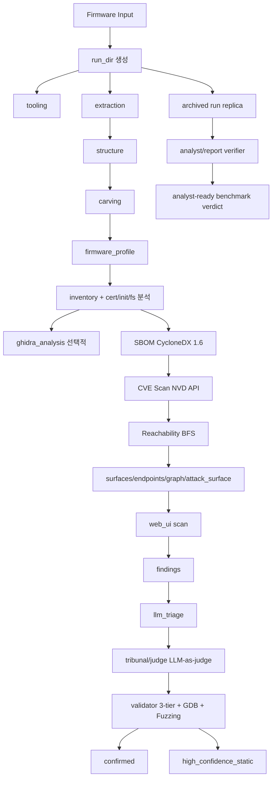

# SCOUT Framework Blueprint (Firmware Input -> Full Chain)

이 문서는 SCOUT의 전체 프레임워크 청사진입니다.

목표는 단일 기능이 아니라, **펌웨어 입력부터 confirmed(동적 증거 포함)까지** 이어지는 end-to-end 체인을 구성하는 것입니다.

## 핵심 원칙

- **증거 우선(Evidence-first)**: 모든 중요한 결과는 run_dir 아래의 파일(artifact)과 sha256로 고정되어야 함
- **결정론(Deterministic)**: LLM이 없어도 stage 산출물이 재현 가능해야 함 (`--no-llm`)
- **승격(confirmed)에는 동적 검증 증거가 필수**: static 분석만으로는 high-confidence여도 confirmed가 될 수 없음
- **Exploit-chain은 lab-gated**: 승인된 범위에서만 실행; 목적은 재현 가능한 검증 evidence 생성
- **Benchmark는 archived bundle까지 포함해 평가**: success/partial 수치만이 아니라 archived run replica가 verifier를 통과하는지까지 품질 계약에 포함
- **LLM은 제안자, verifier는 결정자**: CoT/repair/fallback은 후보 생성·정렬 보조층이며 최종 판정은 deterministic evidence gate가 닫아야 함

## 구성요소

### AIEdge (executor)

- 입력: firmware 파일
- 출력: `aiedge-runs/<run_id>/` (evidence store)
- StageFactory 기반 stage는 `stages/<stage_name>/stage.json`을 남기고, 산출물은 `artifacts[]`에 sha256로 기록
- findings는 StageFactory stage가 아니라 `run_findings()` 통합 단계로 실행되며 `stages/findings/*.json` 산출물을 직접 생성
- LLM-backed stage는 `stages/<stage>/llm_trace/*.json`에 prompt/output/attempt 메타데이터를 남겨 replay/debug 가능성을 유지

### Orchestrator (예: Terminator)

- 입력: AIEdge run_dir + 정책
- 역할:
  - 필요한 stage만 재실행(부분 실행)
  - tribunal/judge로 후보를 평가(비용/캐시 포함)
  - validator로 동적 증거 생성 및 confirmed 승격 정책을 enforce

## 데이터 흐름(요약)

### MCP Server

- `./scout mcp --project-id <run_id>` — stdio 기반 MCP 서버
- 12개 도구: scout_analyze, scout_stage_status, scout_read_artifact, scout_list_findings, scout_sbom, scout_cve_lookup, scout_binary_info, scout_attack_surface, scout_graph, scout_run_stage, scout_list_runs, scout_cert_analysis
- Claude Code, Claude Desktop 등 MCP 호환 AI 에이전트에서 SCOUT 파이프라인을 자율 구동 가능

## 산출물(Artifacts) 계약

- stage 재실행/연동 계약: `docs/aiedge_adapter_contract.md`
- 펌웨어 프로파일/인벤토리 v1 규격: `docs/aiedge_firmware_artifacts_v1.md`

## Benchmark / Archive Fidelity

- benchmark의 표준 archive는 **flattened JSON 모음이 아니라 run replica 전체**여야 함
- `scripts/benchmark_firmae.sh --cleanup`는 now:
  1. archived run replica 보존
  2. archived bundle 기준 verifier 실행
  3. 원본 run_dir 삭제
- benchmark 해석은 두 단계로 나뉨
  - **analysis rate**: 파이프라인 완료 여부
  - **analyst-ready rate**: archived bundle만으로 digest/report verifier와 evidence navigation이 가능한지
- `benchmark-results/legacy/tier2-llm-v2` 같은 old summary-style bundle은 historical reference로만 보고, 현재 contract의 공식 baseline으로 쓰지 않음

## Runtime graph / attribution degradation semantics

- attribution은 extraction stage manifest 자체보다 **inventory roots가 실제로 존재하는지**를 더 중요한 신호로 사용
- runtime communication graph가 비어도 reference graph가 있으면:
  - `communication_graph.json.summary.fallback_reference_graph`
  - `blocked_reason_codes = ["RUNTIME_COMMUNICATION_UNAVAILABLE", "USE_REFERENCE_GRAPH_FALLBACK"]`
  를 남겨 “빈 그래프”와 “설명 가능한 blocked 상태”를 구분
